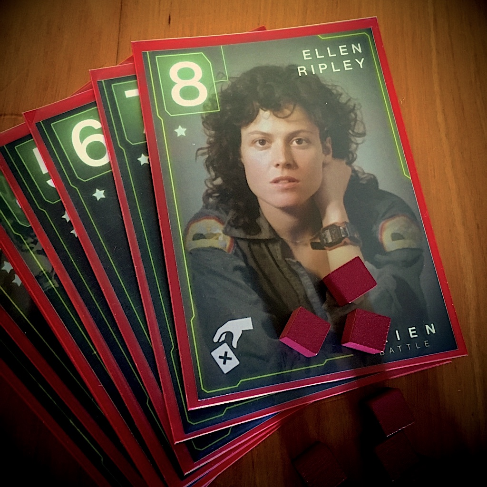

# Alien Battle

> Alien battle es un micro juego de cartas muy sencillo, donde debes
> eliminar a otros jugadores por medio de distintas rondas.

## Características

- 👫 2 a 4 jugadores.
- ⏱ 15 a 20 minutos por partida.

## Instrucciones

En los archivos pdf de la carpera _cartas_, encontraras
lo siguiente:

- 16 cartas de acción
- 1 carta presentación
- 1 carta de instrucciones
- 4 cartas de ayuda personajes

Para jugar necesitas imprimir todas las cartas dispuestas en los archivos pdf.
Además necesitaras 13 tokens o figuras representativas para otorgar los puntos en cada ronda.

## Feedback

Deja tu issue por dudas o mejoras, disfruta el juego ;)
